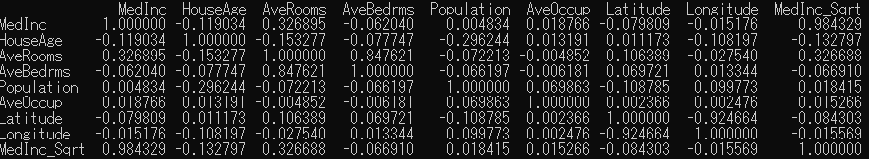

- [Feature Selection](#feature-selection)
  - [1. Remove features with small variance](#1-remove-features-with-small-variance)
  - [2. Remove highly correlated features](#2-remove-highly-correlated-features)
  - [3. Remove features which can not contribute to the target](#3-remove-features-which-can-not-contribute-to-target)
  - [4. Select features through model evaluation](#4-select-features-through-model-evaluation)
    - [4.1 Greedy feature selection](#41-greedy-feature-selection)
    - [4.2 Recursive feature elimination](#42-recursive-feature-elimination)

# Feature Selection

## 1. Remove features with small variance

Features with small variance can be removed because they are same as constants. We can use VarianceThreshold of Scikit-learn to remove such kind of features.

```
from sklearn.feature_selection import VarianceThreshold
data = ...
# create VarianceThreshold object as var_thresh，and set the threshold as 0.1
var_thresh = VarianceThreshold(threshold=0.1)
# transform data with var_threshold to remove features with small variance
transformed_data = var_thresh.fit_transform(data)
```

## 2. Remove highly correlated features
We can check pearson correlation coefficient to remove highly correlated features.
```
import numpy as np
import pandas as pd
from sklearn.datasets import fetch_california_housing
# load data
data = fetch_california_housing()
X = data["data"]
# get feature names
col_names = data["feature_names"]
# get target y
y = data["target"]
df = pd.DataFrame(X, columns=col_names)
# Add the feature of MedInc_Sqrt as the sqrt of MedInc
df.loc[:, "MedInc_Sqrt"] = df.MedInc.apply(np.sqrt)
# calculate the pearson correlation coefficient
df.corr()
```


We can find `MedInc` and `MedInc_Sqrt` are highly correlated, we can remove one of them.

## 3. Remove features which can not contribute to target
We can find features based on their score of correlation with the target. There are two choices for us in scikit.
- SelectKBest: only select K features with highest scores
- SlectPercentile: only select features with percentile given by users

```
from sklearn.feature_selection import chi2
from sklearn.feature_selection import f_classif
from sklearn.feature_selection import f_regression
from sklearn.feature_selection import mutual_info_classif
from sklearn.feature_selection import mutual_info_regression
from sklearn.feature_selection import SelectKBest
from sklearn.feature_selection import SelectPercentile

class UnivariateFeatureSelction:
    def _init _(self, n_features, problem_type, scoring):
        # for classification problems
        if problem_type = "classification":
            # create dictionary of valid_scoring for various scoring method
            valid_scoring = {
                 "f_classif": f_classif,
                 "chi2": chi2,
                 "mutual_info_classif": mutual_info_classif
            }
        # for regression problems 
        else:
            # create dictionary of valid_scoring for various scoring method
            valid_scoring = {
                 "f_regression": f_regression,
                 "mutual_info_regression": mutual_info_regression
            }
    # check if the scoring method is valid
    if scoring not in valid_scoring:
        raise Exception("Invalid scoring function")

    # select features with SelectKBest if n_features are integers
    if isinstance(n_features, int):
        self.selection = SelectKBest(
            valid_scoring[scoring],
            k=n_features
        )
    # select features with SelectPercentile if n_features are floats
    elif isinstance(n_features, float):
        self.selection = SelectPercentile(
            valid_scoring[scoring],
            percentile=int(n_features * 100)
        )
    # otherwise raise exception
    else:
        raise Exception("Invalid type of feature")

    # fit model with given selection method 
    def fit(self, X, y):
        return self.selection.fit(X, y)

    # transform data with given selection method
    def transform(self, X):
        return self.selection.transform(X)

    # transform data and fit model
    def fit_transform(self, X, y):
        return self.selection.fit_transform(X, y)
```
The above class is easy to use as follows
```
ufs = UnivariateFeatureSelction(n_features=0.1,
                                problem_type="regression",
                                scoring="f_regression"
                               )
# fit model
ufs.fit(X, y)
# transform data and select features
X_transformed = ufs.transform(X)
```

## 4. Select features through model evaluation
Evaluate every feature with the given models to find the feature set which gives the best evaluation score. It is a time-consuming method and may lead to model over-fit.
### 4.1 Greedy feature selection
The set of selected features are started from a null set.

```
import pandas as pd
from sklearn import linear_model
from sklearn import metrics
from sklearn.datasets import make_classification

class GreedyFeatureSelection:
    # Give evaluation score
    def evaluate_score(self, X, y):
        # create a model
        model = linear_model.LogisticRegression()
        # train the model
        model.fit(X, y)
        # give inference result
        predictions = model.predict_proba(X)[:, 1]
        # evaluate AUC
        auc = metrics.roc_auc_score(y, predictions)
        return auc

    # Select Features
    def _feature_selection(self, X, y):
        # Initialization
        good_features = []
        best_scores = []
        # find the number of features
        num_features = X.shape[1]

        # loop to select features
        while True:
            this_feature = None
            best_score = 0

            # over all the features
            for feature in range(num_features):
                if feature in good_features:
                    continue
                selected_features = good_features + [feature]
                xtrain = X[:, selected_features]
                score = self.evaluate_score(xtrain, y)

                # Update the feature set if the current set gives a good score
                if score > best_score:
                    this_feature = feature
                    best_score = score
                
            # if a good feature is found
            if this_feature != None:
                # add the feature into good_features
                good_features.append(this_feature)
                # add the score into best_scores
                best_scores.append(best_score)
            # Stop the loop if best_scores is bigger than 2，and the best_scores starts to go down
            if len(best_scores) > 2:
                if best_scores[-1] < best_scores[-2]:
                    break
        # return the best_scores and good_features
        return best_scores[:-1], good_features[:-1]

    # _call_ method
    def _call _(self, X, y):
        scores, features = self._feature_selection(X, y)
        return X[:, features], scores

if _name _ = " _main _":
    # Create input data and the target data
    X, y = make_classification(n_samples=1000, n_features=100)
    # Create a GreedyFeatureSelection object and run _call _ method
    X_transformed, scores = GreedyFeatureSelection()(X, y)
```

### 4.2 Recursive Feature Elimination
Feature selection is started from a feature set which contains all the features. Less important feature are removed from the set in the evaluation loop.
In a SVM/linear regression model,The coefficient of the each feature is used to evaluate the feature importance.
```
import pandas as pd
from sklearn.feature_selection import RFE
from sklearn.linear_model import LinearRegression
from sklearn.datasets import fetch_california_housing
data = fetch_california_housing()
X = data["data"]
col_names = data["feature_names"]
y = data["target"]
model = LinearRegression()
# create RFE object to select three features
rfe = RFE(
    estimator=model,
    n_features_to_select=3
)
# train
rfe.fit(X, y)
# feature selection
X_transformed = rfe.transform(X)

```
In a tree-based model, and the feature importance is used. 
```
import pandas as pd
from sklearn.datasets import load_diabetes
from sklearn.ensemble import RandomForestRegressor
data = load_diabetes()
X = data["data"]
col_names = data["feature_names"]
y = data["target"]
# Initiate a random forest model
model = RandomForestRegressor()
# Train the model
model.fit(X, y)
# get importance
importances = model.feature_importances_
# sort the importance
idxs = np.argsort(importances)
plt.title('Feature Importances')
plt.barh(range(len(idxs)), importances[idxs], align='center')
plt.yticks(range(len(idxs)), [col_names[i] for i in idxs])

plt.xlabel('Random Forest Feature Importance')
plt.show()
```
`SelectFromModel` is a helpful function of scikit-learn to run RFE
```
import pandas as pd
from sklearn.datasets import load_diabetes
from sklearn.ensemble import RandomForestRegressor
from sklearn.feature_selection import SelectFromModel
data = load_diabetes()
X = data["data"]
col_names = data["feature_names"]
y = data["target"]
# Initiate a random forest model
model = RandomForestRegressor()
# create a SelectFromModel with the random forest model
sfm = SelectFromModel(estimator=model)
# Train the model
X_transformed = sfm.fit_transform(X, y)
# find the selection result（True shows selected）
support = sfm.get_support()
# print out the result
print([x for x, y in zip(col_names, support) if y = True ])
```
We can also use L1(Lasso) model to select useful features.